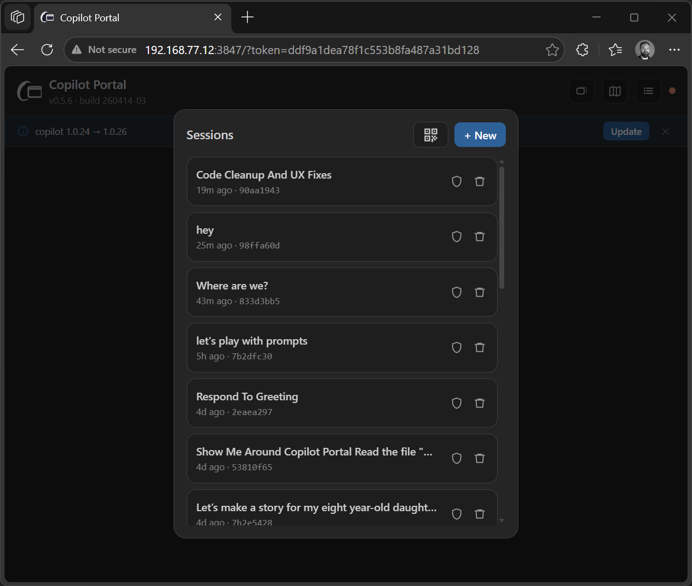
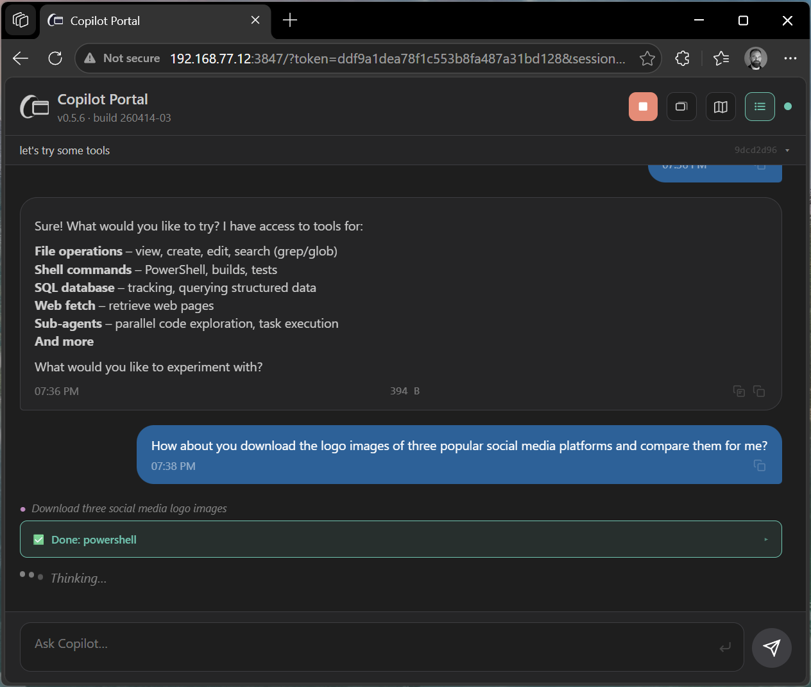
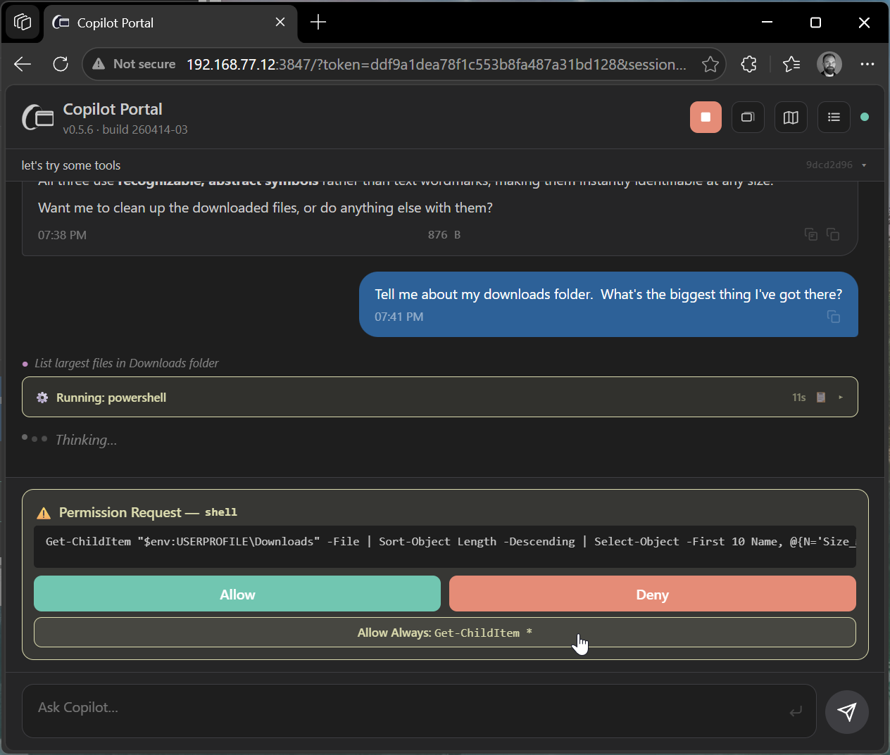
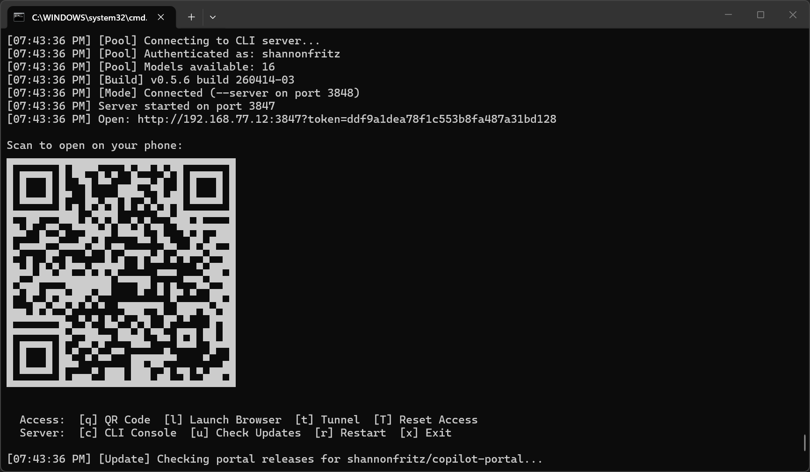
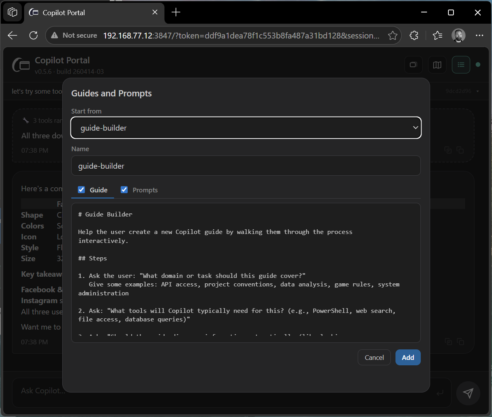
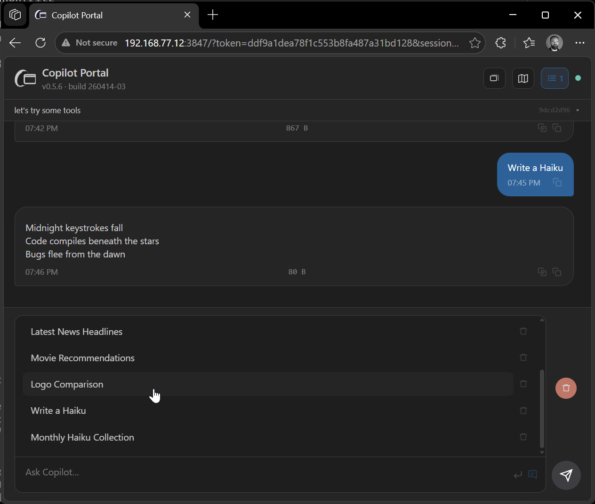
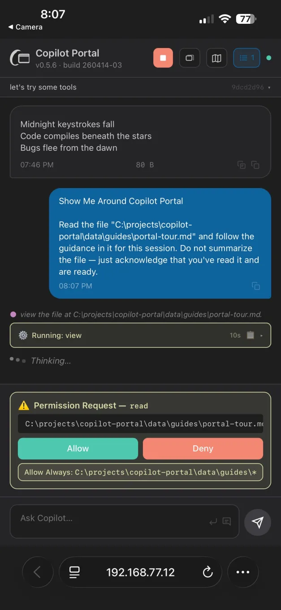
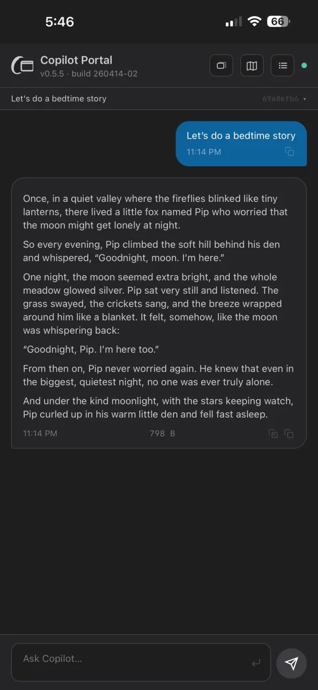
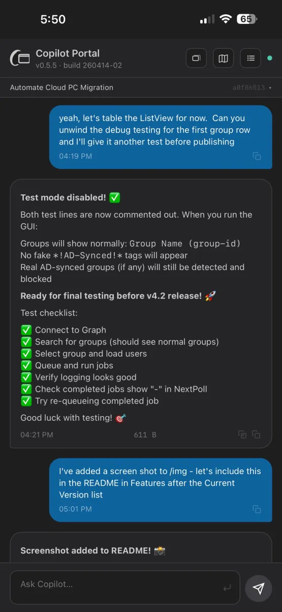
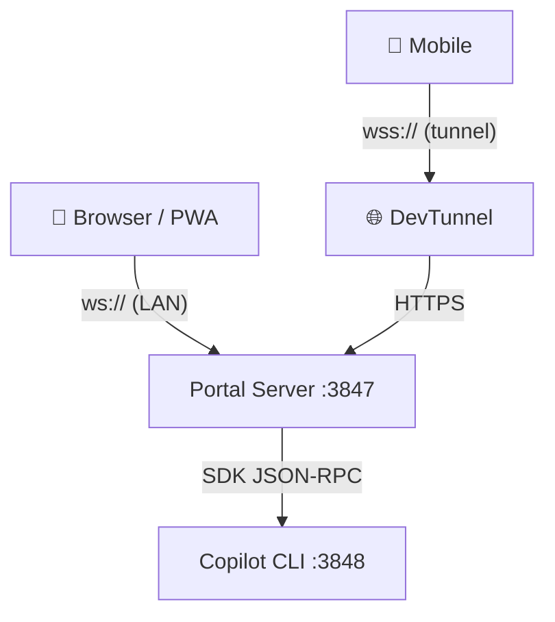

# Copilot Portal

A mobile-friendly web portal for GitHub Copilot CLI sessions. Start the server on your PC, then open the URL on any device — same network via QR code, or anywhere via DevTunnels.

## Prerequisites

- [Node.js](https://nodejs.org/) v22 or later
- [GitHub Copilot CLI](https://docs.github.com/copilot/how-tos/copilot-cli) — `winget install GitHub.CopilotCLI` (Windows) or `brew install gh-copilot` (macOS)

## Getting Started

1. Unzip the release to a folder of your choice.
2. Run `start-portal.cmd` (Windows) or `sh start-portal.sh` (macOS/Linux).
3. Scan the QR code from your phone, or open the URL in any browser.

On first run, the script installs dependencies, signs you in to GitHub, and starts the CLI server automatically.

<a href="img/screenshot-sessions.png"></a>

<p>
<a href="img/screenshot-tools.png"></a>
<a href="img/screenshot-approvals.png"></a>
</p>

## Console Keys

While the server is running, press a key in the terminal:

| | Access | | Server |
|---|---|---|---|
| **q** | QR code & URL | **c** | CLI console |
| **l** | Launch browser | **u** | Check updates |
| **t** | Start/stop tunnel | **r** | Restart |
| **T** | Security reset | **x** | Exit |

**Tunnel** creates a DevTunnel for remote access (HTTPS from anywhere). Press **t** to start, **t** again to stop. First time, it asks about access settings. The tunnel auto-restarts after a server restart.

**Security reset** (Shift+T) destroys the tunnel, rotates the access token, and disconnects all clients. Use if a URL was compromised. Press **q** for a new QR code, then **t** for a new tunnel.

<a href="img/screenshot-console.png"></a>

## Guides & Prompts

Guides are markdown files that teach Copilot how to behave for a session. Prompts are canned queries that appear in a tray above the message box.

- Click the map icon in the header to browse, apply, edit, or create guides and prompts
- **+ New** — start from scratch, pick from example templates, or import from a GitHub Gist URL
- Files live in `data/guides/` and `data/prompts/` — same filename pairs them
- Prompts stack across multiple sources and persist per session

<p>
<a href="img/screenshot-guides.png"></a>
<a href="img/screenshot-prompts.png"></a>
</p>

### Importing

Share guides via GitHub Gists using the naming convention:
```
my-guide_guide.md       → guide content
my-guide_prompts.md     → companion prompts
```

Import via **+ New → Import from URL** in the portal.

## Mobile & PWA

- Scan the QR code to open on your phone (same network)
- Use Share → Add to Home Screen for a standalone app experience
- Press **t** in the terminal for remote access via DevTunnel

<p>
<a href="img/screenshot-mobile1.png"></a>
<a href="img/screenshot-mobile2.png"></a>
<a href="img/screenshot-mobile3.png"></a>
</p>

## Security

- All API and WebSocket endpoints require a token (generated on first run, saved to `data/token.txt`)
- Security headers: CSP, HSTS (over tunnel), X-Frame-Options, referrer policy
- Rate limiting on failed auth attempts
- Press **T** to rotate the token and revoke all access

## Architecture



<details>
<summary>ASCII version</summary>

```
  📱 Browser / PWA          📱 Mobile
        │                       │
    ws:// (LAN)          wss:// (tunnel)
        │                       │
        ▼                       ▼
  Portal Server :3847 ◄── 🌐 DevTunnel
        │
   SDK JSON-RPC
        │
        ▼
  Copilot CLI :3848
```
</details>

The portal connects to a headless Copilot CLI server running in the background. Messages are bidirectional — the CLI console and portal share the same sessions.

## Configuration

| Flag | Default | Description |
|---|---|---|
| `--port N` | 3847 | Portal server port |
| `--cli-url URL` | auto | Connect to a specific CLI server |
| `--data DIR` | `data/` | Data directory for token, rules, guides |
| `--new-token` | — | Generate a new access token on start |
| `--launch` | — | Open browser on start |
| `--no-qr` | — | Suppress QR code output |

---

## Development

For contributors working from the source repository.

```bash
npm install          # install dependencies
npm run build        # build server + web UI
npm run package      # create release zip
```

### Versioning

- **Version** (`v0.5.4`) — semver in `package.json`, bumped for releases
- **Build** (`260414-01`) — `YYMMDD-NN` in `BUILD`, auto-incremented by `npm run package`

### Project Structure

```
src/              Server source (TypeScript)
webui/src/        React UI source
dist/             Compiled output
examples/         Shipped guide/prompt templates (read-only)
data/             User runtime data (gitignored)
docs/             Design docs and specs
```
